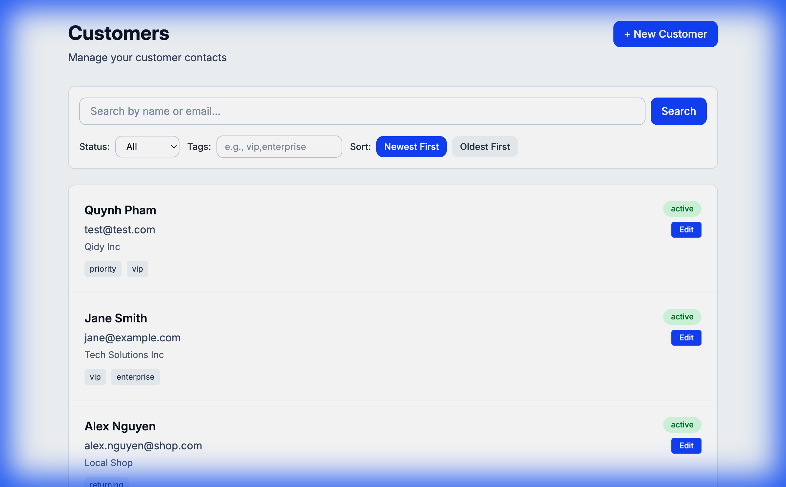
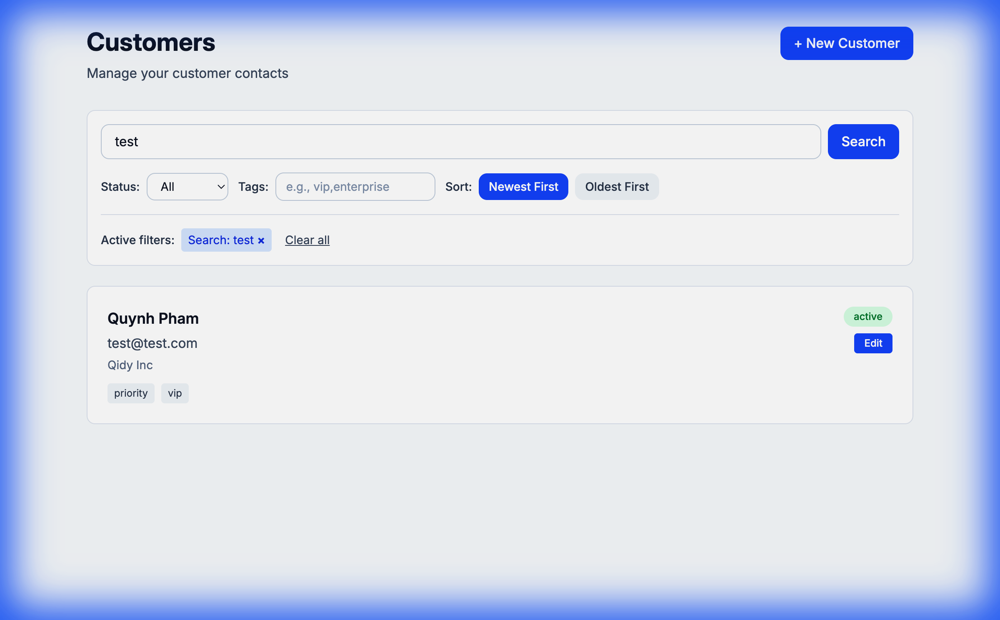
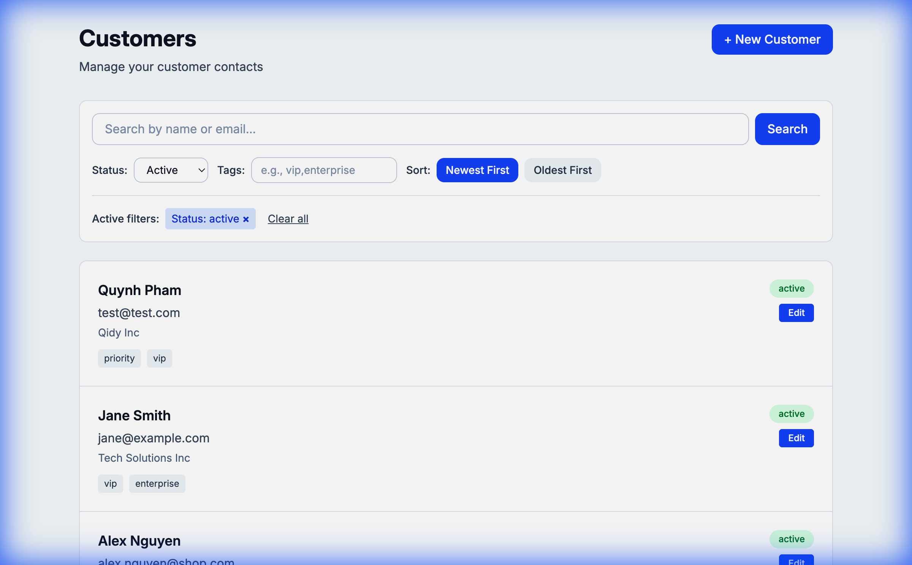
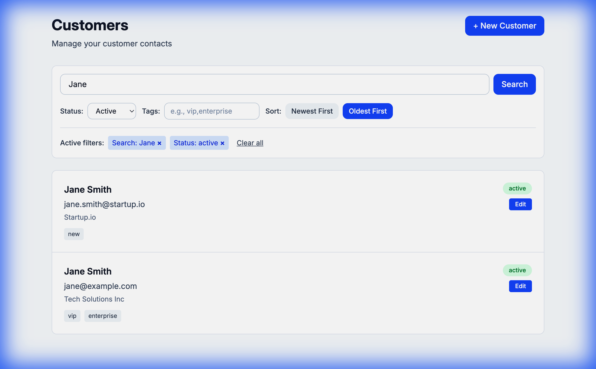
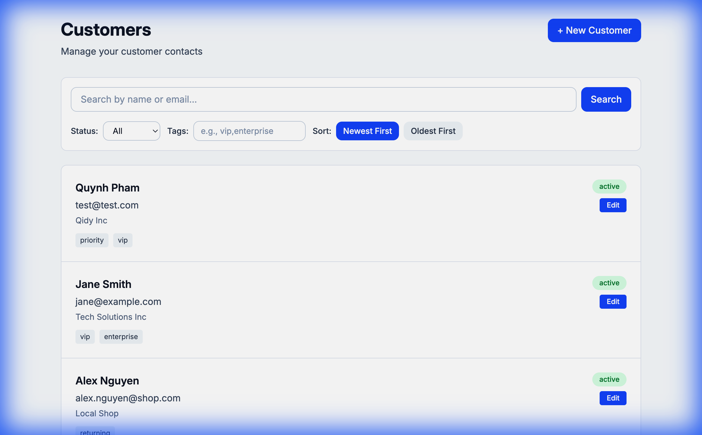

# Phase 8: Search, Filter, and Sort - Demo Videos & Screenshots

This folder contains all the demo videos and screenshots from Phase 8 implementation.

## Video Recording

**[phase8_search_filter_sort_demo.webp](./phase8_search_filter_sort_demo.webp)** (4.3 MB)
- Complete walkthrough of all search, filter, and sort features
- Shows search by name/email, status filtering, tag filtering, and sorting
- Demonstrates combined filters and query param preservation

## Screenshots

### Initial State

- Customer listing page with new search, filter, and sort controls

### Search Functionality

- Search results for "test" showing URL param `?search=test`

### Status Filter

- Filtered by "active" status with URL param `?status=active`

### Combined Filters

- Search "Jane" + Status "active" + Sort "Oldest First"
- URL: `?search=Jane&status=active&sortField=createdAt&sortOrder=asc`

### Cleared State

- After clicking "Clear all" - back to default view

## Features Demonstrated

✅ Search by name and email (case-insensitive)
✅ Filter by status (active/inactive)  
✅ Filter by tags (comma-separated)
✅ Sort by creation date (ascending/descending)
✅ Combined filters work together
✅ URL query params preserved on navigation
✅ Individual filter clear buttons
✅ "Clear all" functionality
✅ SSR-compatible server-side filtering

## How to Use for Showcase

1. **Show the video**: Open `phase8_search_filter_sort_demo.webp` in a browser to see the full demo
2. **Reference screenshots**: Use individual screenshots to highlight specific features
3. **Share the folder**: All files are self-contained and ready to share

---

Generated: 2026-01-05
Phase: 8 - Search, Filter, and Sort Customers
